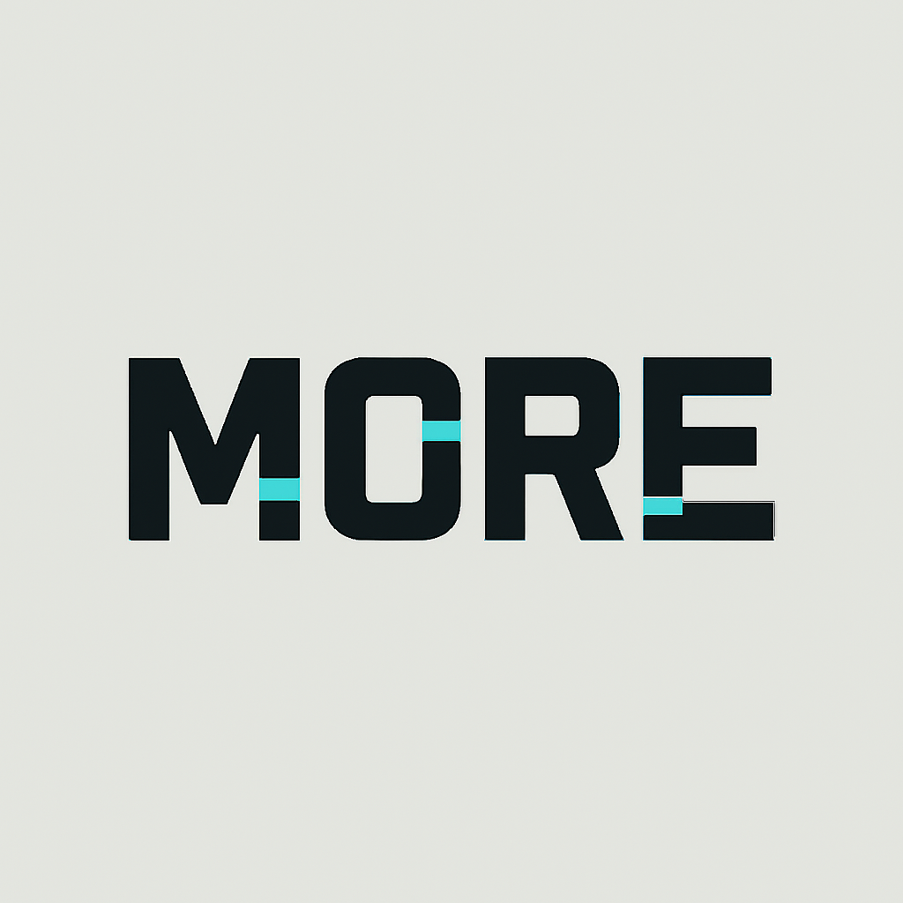

# MORE Earn — Kaia USDT

MORE Earn is **Mini dApp** uilt for the **Kaia Stablecoin (USDT)**.  
Developed as part of the **Kaia Wave Stablecoin Summer Hackathon**.

---

## ✨ Key Features

### 0. Core
- Connect wallet (Kairos 1001).
- Deposit & Withdraw USDT (mock).
- Display wallet balance & Vault TVL.


### 1. Earn
- Display APY (default: 5%).
- Daily and monthly earnings projections based on user stake.

### 2. Missions
- **Mission #1**: First deposit ≥ 100 USDT.
- **Mission #2**: 3x deposit ≥ 10 USDT.
- Mission status is tracked via `Deposit` & `MissionCompleted` events.

### 3. Activity
- User deposit & withdrawal history.
- Pulled from on-chain events with links to **Kairos Scope** explorer.

### 4. Referral (coming soon)
- Referral link `?ref=0x...`
- Leaderboard top referrers.

### 5. Rewards (coming soon)
- Off-chain points system for gamified engagement.

---

## 🏗️ Tech Stack

- **Smart Contracts**: Solidity + Hardhat + OpenZeppelin
- **Frontend**: Next.js 14 + TailwindCSS
- **Wallet**: MetaMask / OKX Wallet (Kairos 1001)
- **Analytics**: Dune Dashboard (planned)
- **Docs/Deck**: Pitch deck (DocSend link)

---

## 📂 Repository Structure

kaia-defai-earn/
├── contracts/ # Smart contracts (DefaiVault, MockUSDT, dll)
├── scripts/ # Deploy & test scripts (Hardhat)
├── front-miniapp/ # Next.js Mini dApp frontend
├── deck/ # Pitch deck (PDF/PPTX, DocSend link)
├── dune/ # Dune Analytics query / README link
├── .env.example # Contoh konfigurasi env
├── hardhat.config.ts # Hardhat config
├── package.json # Dependencies
└── README.md # Dokumentasi

yaml
Copy code

---

## ⚙️ Setup & Deploy

### 1. Clone repo
```bash
git clone https://github.com/xxcode2/kaia-defai-earn.git
cd kaia-defai-earn
2. Install dependencies
bash
Copy code
npm install
3. Deploy contracts (Kairos testnet)
Update .env:

bash
Copy code
PRIVATE_KEY=0xyourprivatekey
USDT=0xMockUSDTAddress
Deploy vault:

bash
Copy code
npm run deploy:vault --network kairos
4. Run frontend
bash
Copy code
cd front-miniapp
npm install
npm run dev
Frontend default di http://localhost:3000.
